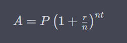

# Desafio: Cálculo de Juros Compostos

## Descrição

Imagine que você está desenvolvendo um aplicativo para um banco que deseja calcular os juros compostos de um investimento. Seu objetivo é criar uma função que receba três parâmetros: o valor inicial do investimento, a taxa de juros anual e o período de tempo em anos. A função deve calcular e retornar o valor final do investimento após o período determinado, levando em consideração os juros compostos.

## Entrada

A função deve receber os seguintes parâmetros:

- `valor_inicial`: um número inteiro ou decimal representando o valor inicial do investimento.
- `taxa_juros`: um número decimal representando a taxa de juros anual. Por exemplo, se a taxa for de 5%, o valor passado será 0.05.
- `periodo`: um número inteiro representando a quantidade de anos do investimento.

## Saída

A função deve retornar o valor final do investimento após o período determinado, considerando os juros compostos. O valor final deve ser arredondado para duas casas decimais.

## Fórmula Utilizada para resolução do Cálculo

O cálculo do valor final do investimento com juros compostos é baseado na seguinte fórmula:



onde:

- **A** é o valor final do investimento.
- **P** é o valor inicial do investimento.
- **r** é a taxa de juros anual (decimal).
- **n** é o número de vezes que o juro é composto por ano.
- **t** é o número de anos em que o dinheiro é investido.


---

**Exemplo:**

```python
# Entrada
valor_inicial = 1000.0
taxa_juros = 0.05
periodo = 3

# Saída
# Valor final calculado: 1000 * (1 + 0.05)^3 = 1157.63
valor_final = calcular_juros_compostos(valor_inicial, taxa_juros, periodo)
print(f"Valor final do investimento após {periodo} anos: {valor_final}")
```

Neste exemplo, a função `calcular_juros_compostos` calcula o valor final do investimento após 3 anos, levando em consideração uma taxa de juros anual de 5%. O valor final é arredondado para duas casas decimais e impresso no console.